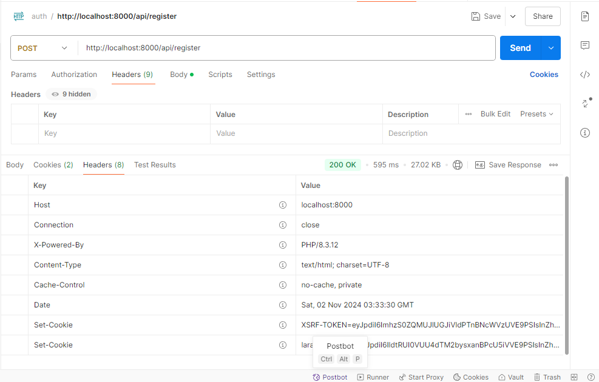
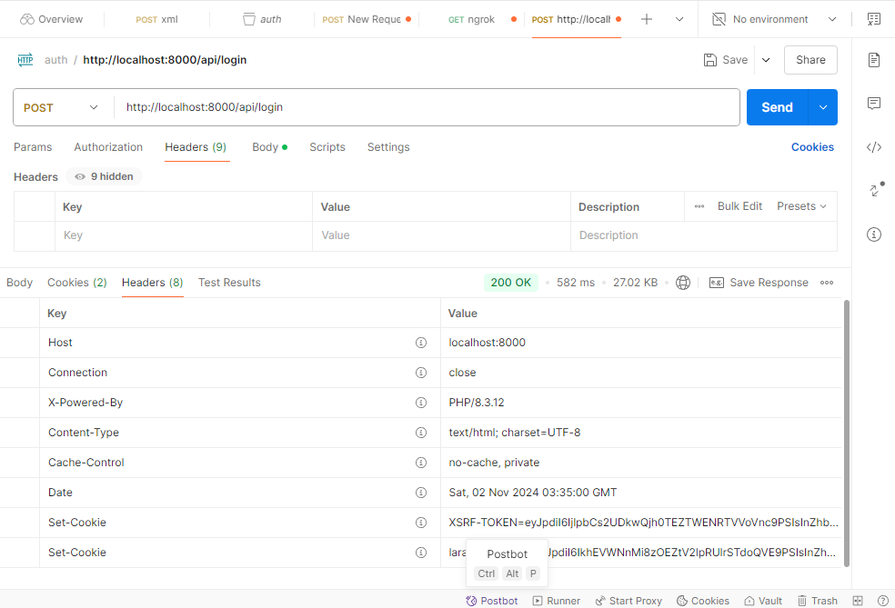
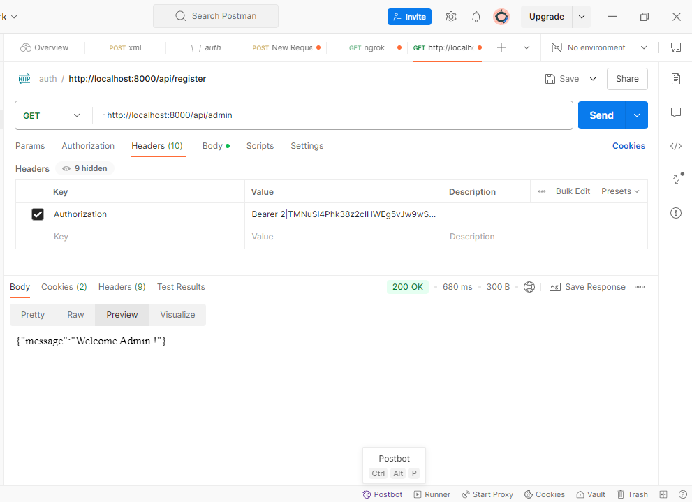
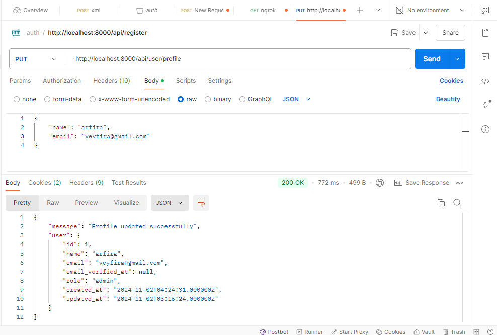
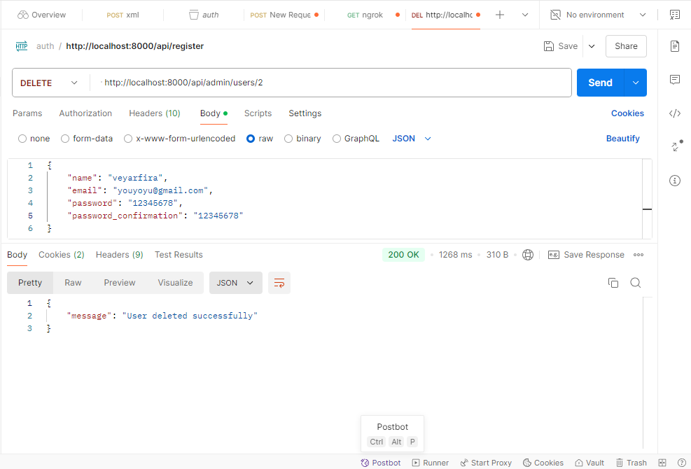
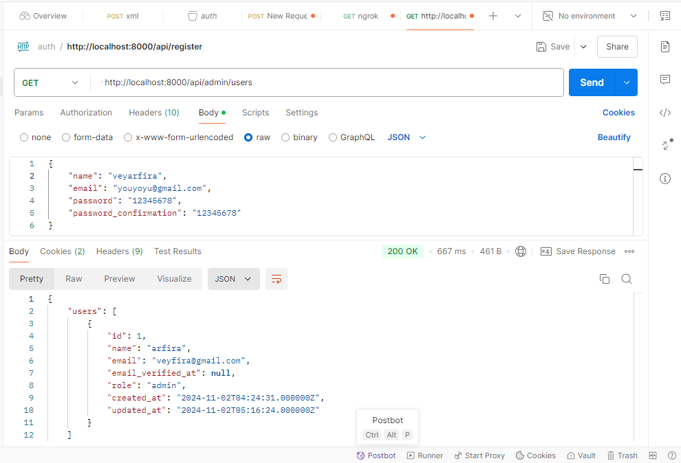

PRAKTIKUM

EVALUASI
1. Apa yang dimaksud dengan Laravel Sanctum?
Laravel Sanctum adalah paket Laravel untuk mengelola otentikasi API dengan cara yang sederhana dan ringan.
Sanctum memungkinkan aplikasi untuk membuat token API bagi pengguna dan mendukung otentikasi untuk single-page applications (SPA) menggunakan cookie tanpa perlu setup yang rumit seperti OAuth.
2. Bagaimana cara mengelola token autentikasi di Laravel?
~Instal Laravel Sanctum
~Konfigurasi Model User
~Buat Endpoint untuk Login dan Pembuatan Token
~Menggunakan Token untuk Autentikasi di API
~Membuat Middleware untuk Melindungi Endpoint
~Logout dan Menghapus Token
~Refresh Token (Opsional)
3. Sebutkan langkah-langkah untuk menambahkan otorisasi berbasis peran dalam API!
~Menambahkan Kolom role pada Tabel users
~Tambahkan Nilai role di Model User
~Menambahkan Middleware untuk Otorisasi Berdasarkan Peran
~Daftarkan Middleware di Kernel.php
~Menambahkan Middleware role ke Route
~Menambahkan Cek Otorisasi di Controller (Opsional)
~Pengujian

TUGAS PRAKTIKUM

